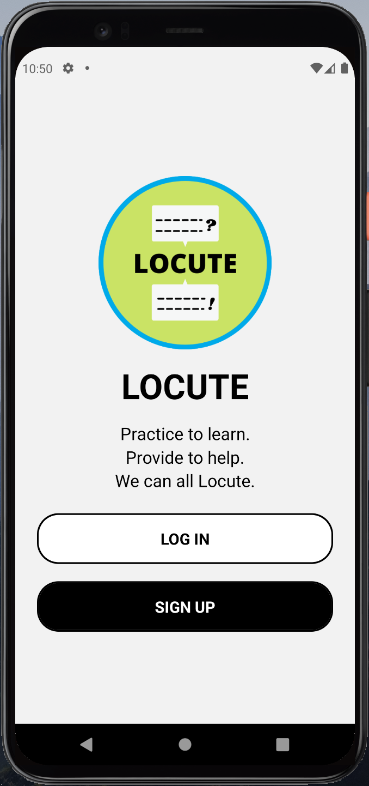
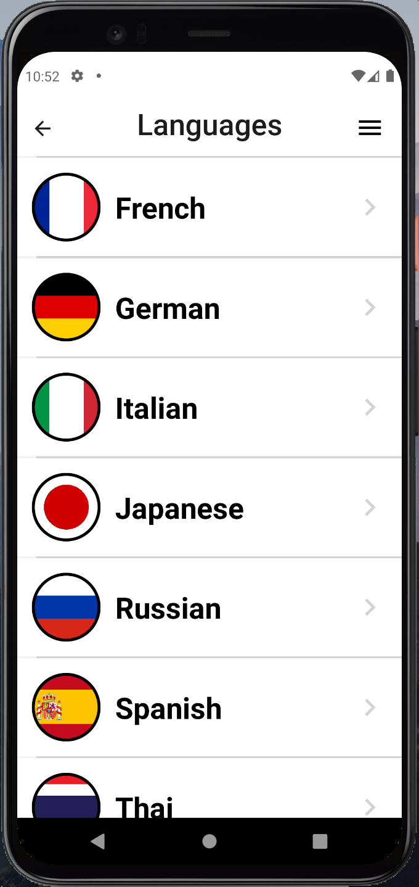

# Locute
A crowd-sourced immersive language learning mobile app.  
 

### Objective
The goal of this app is to allow two types of users to translate provided scenarios in selected languages. The Content Provider (CP) provides prompt and answer translations (text and audio) of a selected scenario for Languages Learners (LL) to interact with. The Language Learner can read and play scenario prompt translations (provided by the CP) and practice answering the prompts in the selected language via audio recording or text input. The LL’s answer is graded against the CPs answer and a success or failure is reported to the LL.  
 

### In This Document
- [Installation](#installation)
- [Instructions](#instructions)
 

# Installation
The app can be accessed using the provided `.apk` file, `Locute.apk`. Simply drag and drop the `.apk` file onto a running Android emulator. You will see a screen indicating the APK is being installed (Figure 1). When installation is complete, swipe from the bottom of the home screen upwards to see the list of apps installed on the Android device. Language App should be in the list of apps (Figure 2). Click on the app to open.  

To use the recording feature you must enable the microphone on the emulator. Click on the ‘Extended Controls’ button from the emulator menu (Figure 2, red circle). Within the Extended Controls menu, select ‘Microphone’ from the left-side menu. Toggle-on the third option: ‘Virtual microphone uses host audio input’. 

If an Android emulator is not already set up, refer to the following resources to [download Android Studio](https://developer.android.com/studio) and [create a virtual device](https://developer.android.com/studio/run/managing-avds.html). 

  

*Figure 1. APK installation on Android emulator*  
 

  

*Figure 2. List of installed apps on the Android device*  

 

# Instructions
This app starts at the Welcome Screen (Figure 3) where clicking on the Locute logo will bring up an About page with directions for interacting with the app. The user can Log In as an existing user or Register as a new user. Clicking either button will take teh user to the application screen to input credentials.

  
  

*Figure 3. Opening welcome screen. About page is accessed by clicking on the Locute logo*  
 

The next screen (Figure 4) allows the user to participate as a Content Provider or Language Learner. Select either path to continue. The three subsequent screens (Figures 3 - 5) are similar for both user types, with the final fourth screen (Figures 8 - 9) being different. 

  

*Figure 4. User Type selection screen*  
 

The Languages screen (Figure 5) displays a scrollable list of languages to choose from. Select any language to proceed to the next screen. The Menu button allows the user to logout or return to the screen to select the user type. This button is the same on the subsequent screens.  

  

*Figure 5. Scrollable language selection list*  
 

The Categories screen (Figure 6) displays a scrollable list categories to choose from. Select any category to proceed to the next screen. 

  

*Figure 6. Scrollable category selection list*  
 

The Scenarios screen (Figure 7) displays a scrollable and searchable list of scenarios to translate. The title and prompt of each scenario is displayed.  

  

*Figure 7. Scrollable scenario selection list*  
 

Figure 8 displays the Translation screen for the Content Provider. Displayed in English are the scenario title, image, prompt, and answer. The blue recording buttons are used to record the CP’s translation and the text boxes are for the written translations. The Submit button will submit all translation data to the database and store the audio files in a cloud storage.  

  

*Figure 8. Scenario translation page for content providers*  
 

Figure 9 displays the Translation screen for the Language Learner. Displayed are the scenario title, scenario image, translated prompt, and button to play the translation audio recorded by the CP. The LL can choose to record or type their answer in the given language. If the answer is recorded, it is transcribed directly into text and displayed in the text box. The Submit button will grade the LL’s answer attempt by comparing it text-wise to CP's answer. ‘Show answer’ will display the translated answer text. ‘Play answer’ plays the audio recording of the translated answer.  

  

*Figure 9. Scenario translation page for language learner*  
 